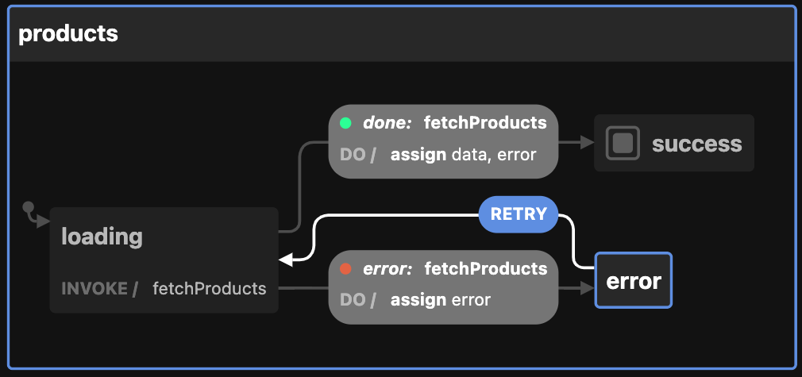

# XState: State Management Machine

Most programs employ some kind of state, regardless of the type of software. State management is a fundamental component of developing software, whether it is for internal state or data obtained via an API.

The majority of them employ a bottom-up strategy for managing states, in which the state is composed of discrete stateful variable units dispersed across the codebase.

However, monitoring and controlling such stateful variables is more difficult as an application gets larger. It becomes more difficult to update the state in a predictable and effective manner, which might facilitate bug infiltration. When there are no clear rules and code documentation, this is much worse.

## Why are state machines necessary?

Let's examine a situation that most developers have undoubtedly encountered before defining state machines and examine the drawbacks of the way state is currently handled. Although I'll use React as an example, the idea is applicable to any framework.

Consider a component where you have a button that you can click to send a request to an API to get products from a backend. The following states are possible for this component:

- Idle: No request has been made or is in the process of being made. By default, things are like this.
- Loading: A request is being made while it loads. When you click the button, this occurs.
- Success: The request has been fulfilled and is now successful.
- Error: A request is fulfilled, but it is unsuccessful for some reason.

In what way would you model the state in order to use this component? The majority of developers, including me, would most likely take a similar action.

```js
const Products = () => {
  const [products, setProducts] = useState(null);
  const [isLoading, setIsLoading] = useState(false);
  const [error, setError] = useState(null);
};
```

This appears to be fine at first look. Let's say that when you press the button to retrieve products for the first time, the following happens:

- You move into the state of loading
- You leave the loading state if the request is approved.
- With the new information, you update the products state variable.
- You also leave the loading state if the request was unsuccessful.
- With the request error, you update the error state variable.

```js
...other code
const handleButtonClick = async (event) => {
  event.preventDefault()
  // Exit early if already making a request
  if (isLoading) return
  try {
    setIsLoading(true)
    const newProducts = await api.fetchProducts()
    setProducts(newProducts)
    // we add a check for previous errors
    if (error) {
      setError(null)
    }
  } catch (error) {
    setError(error)
    // we add a check for previous products data
    if (products) {
      setProducts(null)
    }
  } finally {
    setIsLoading(false)
  }
}
...other code
```

This also functions, but now you can see how strewn with conditionals the logic is. This is acceptable for a small example like this, but it can become challenging to maintain for larger, production-ready applications.

Additionally, because this state logic is so closely linked to the component, we are unable to reuse any of it. Decoupling state management from business logic is one advantage of state machines.

You now need to slow down and take into consideration all of the conditionals and state updating code, making the code much more difficult to understand at first glance.

## State machines come to the aid

What we require is a method for controlling the state of our application so that none of the problems we've looked at above can happen. I would think the following items would be helpful in an app state model:

- There should only be one state for the app at once.
- It is necessary to define the possible valid states explicitly.
- Business logic and state logic shouldn't be closely entwined.
- Reasoning should be simple, and one should be able to infer information about past and future states from the present state.

Here's where state machines come into play.

### What is state?

Let's define "state" for the purposes of this discussion before moving on to state machines. According to Wikipedia, "state" in relation to state machines means —

"A system's state is an explanation of its current condition while it awaits the execution of a transition."

State, as used in software terminology, refers to the collection of all variables and their values at any one time. This is significant to remember because a program can exist in a greater number of states the more variables it contains.

One technique to lower the quantity of variables and invalid states is to use a state machine. It accomplishes this by outlining a clear set of acceptable states, how these states transition, and any unintended consequences that may arise.

So how does this actually function and how does it lessen app bugs? Now, let's return to our previous example of the Products component. Which bugs did we find?

- The component may be in multiple states simultaneously.
- The product's repeated button clicks may have created a race condition.
- An excessive number of conditionals exist.
- The code is closely linked to business logic, making it challenging to understand.

Let's rerun the product fetching example, this time utilizing a state machine.

```js
const productsMachine = createMachine(
  {
    id: "products",
    initial: "idle",
    context: {
      data: null,
      error: null,
    },
    states: {
      idle: {
        on: { FETCH: "loading" },
      },
      loading: {
        invoke: {
          src: "fetchProducts",
          onDone: {
            target: "success",
            actions: assign({
              data: (_, event) => event.data,
              error: null,
            }),
          },
          onError: {
            target: "error",
            actions: assign({
              error: (_, event) => event.data,
            }),
          },
        },
      },
      success: {
        type: "final",
      },
      error: {
        on: {
          RETRY: "loading",
        },
      },
    },
  },
  {
    services: {
      fetchProducts: async () => {
        const response = await fetch(api.fetchProducts());
        const data = await response.json();
        return data;
      },
    },
  }
);
```

### The structure of an X-State device

Let us analyze the situation at hand. The components of this machine are as follows:

- id: The machine's string identification. This is helpful in determining the device that initiated an update. While not necessary, it can be helpful when troubleshooting an application.

- initial: The machine's initial state. There is an initial state for every state machine. This is how things were before any changes or actions were made.

- context: The machine's internal condition. This can be used to store objects, strings, numbers, and other quantitative data that your application requires.

- states: This is a representation of all the machine's states, operations, and potential transitions. For example, idle represents the idle state, loading represents the loading state, and so on. Each key in the states object corresponds to a state.

The actions and potential transitions from that state are modeled by the 'on' property. Let us examine an instance.

```js
error: { // For this error state
    on: { // This holds all possible actions this state can handle
        RETRY: "loading",
        // On the RETRY action, transition to the loading state
       },
    },
```

This is the most straightforward approach, but there are other ways to manage actions and transitions in XState.

When we change into a new state, XState also gives us the option to start side effects. We might want to initiate a network request to retrieve some data, for instance, when we move into the loading state. And change to the success (or error) state once that request has been completed.

Let's examine that process —

```js
// For this loading state
loading: {
  // When we transition into the loading state,
  invoke: {
  // call a "fetchProducts" function which returns a promise
    src: 'fetchProducts',
    // If the promise is resolved,
    onDone: {
      // Transition to the success state
      target: 'success',
      // And update the context data
      actions: assign({
        data: (_, event) => event.data,
      }),
    },
    // If the promise is rejected
    onError: {
     // Transition to the error state
      target: 'error',
      // And update the context data
      actions: assign({
        error: (_, event) => event.error,
      }),
    },
  },
},
```

Keep in mind that when the productsMachine is initialized, an argument will be passed to the fetchProducts function. Observe also how, in contrast to the previous technique in the idle state, we are changing to a new state differently.

[For a complete list of configuration options, consult the XState documentation.](https://xstate.js.org/docs/guides/machines.html#configuration)

Although this implementation seems more labor-intensive than the last one at first, there are some advantages.

- You can quickly view every state that the app could be in.
- Less state variables need to be monitored.
- Since every legitimate state is clearly defined, the possibility of impossible states is completely eliminated.
- It is possible to separate the state management from the application (the code above can be used with any framework).
- Side effects are addressed and defined in detail.

Using state machines to model our application state has several advantages, these being just a few. A visual depiction of the states and actions can also be obtained by pasting this code into a statechart visualiser.

You can now interact with the XState visualiser by pasting the above code into it.



Afterwards, we can use this device in our Products component and make the following updates:

```jsx
import React from "react";
import { useMachine } from "@xstate/react";
import productsMachine from "./productmachine";

export const Products = () => {
  const [state, send] = useMachine(productsMachine);
  const handleClick = () => {
    send("FETCH");
  };
  return (
    <div>
      <button onClick={handleClick}>Fetch Products</button>
      {state.matches("loading") && <p>Loading...</p>}
      {state.matches("success") && (
        <>
          <p>Data loaded:</p>
          <pre>{JSON.stringify(state.context.data, null, 2)}</pre>
        </>
      )}
      {state.matches("error") && (
        <div>
          <pre>{JSON.stringify(state.context.error, null, 2)}</pre>
          <button onClick={() => send("RETRY")}>Retry</button>
        </div>
      )}
    </div>
  );
};
```

Let's break down the key aspects of code:

### State Machine Integration:

```js
const [state, send] = useMachine(productsMachine);
```

We're using the useMachine hook to integrate the productsMachine state machine into your component. The state variable holds the current state of the machine, and send is a function used to send events to the machine, triggering state transitions.

### Sending a Call to Product's Machine Action

```js
const handleClick = () => {
    send("FETCH");
  };
```
Here, we're using our initial state, "send("FETCH)," to start the XState machine which calls the endpoint.

### Render Function:

```js
return (
  <div>
    <button onClick={handleClick}>Fetch Products</button>
    {state.matches("loading") && <p>Loading...</p>}
    {state.matches("success") && (
      <>
        <p>Data loaded:</p>
        <pre>{JSON.stringify(state.context.data, null, 2)}</pre>
      </>
    )}
    {state.matches("error") && (
      <div>
        <pre>{JSON.stringify(state.context.error, null, 2)}</pre>
        <button onClick={() => send("RETRY")}>Retry</button>
      </div>
    )}
  </div>
);
```

The component's render function displays different content based on the current state of the state machine:

- If the state is "loading," it shows a loading message.
- If the state is "success," it displays the loaded data in a formatted JSON string.
- If the state is "error," it shows the error details in a preformatted block and provides a "Retry" button that triggers a "RETRY" event when clicked.

## What comes next?

Thank you for reading this article through to the end, and congrats on learning something new today. You can use these resources to learn more about statecharts if you're interested in doing so.

- [The official records for XState](https://xstate.js.org/docs/)

Since this article only serves as an introduction to the vast field of state machines, I suggest looking through the previously mentioned resources if you're interested in developing practical applications.
